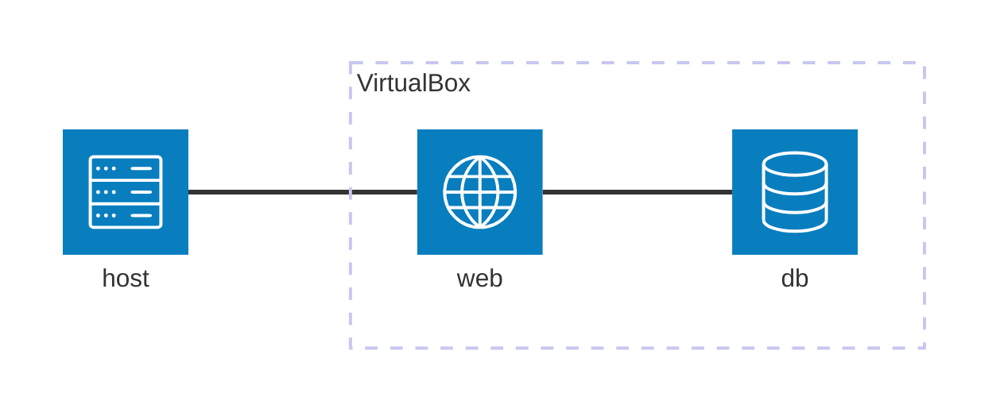
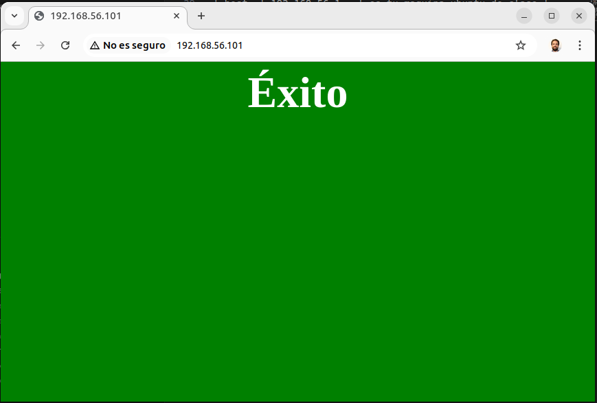

# Examen Firewall y seguridad en red

## Lee con atención

La solución a este ejercicio la tienes que escribir en los ficheros `db.sh`, `web.sh` y `jail.local`. Es decir **NO HACE FALTA CAMBIAR NINGÚN FICHERO MÁS QUE ESOS TRES**

Tip: Puedes usar `vagrant provision` para refrescar las máquinas con los cambios que vayas haciendo en los ficheros sh.

Una vez todo funcione, puedes usar  `zip -r <tunombre>.zip .` para empaquetarlo todo en un fichero ZIP y subirlo a la tarea.

## Detalles

Este examen tiene adjunto una definición de infrastructura virtual lista para ser ejecutada con Vagrant. Levanta las máquinas haciendo uso del siguiente comando:

```sh
vagrant up
```

Tras unos minutos, tendrás levantada las máquinas según este esquema:



Las IPs que tendrás que usar durante la prueba serán las siguientes:

|       | ip             | descripcion                   |
|-------|----------------|-------------------------------|
| host  | 192.168.56.1   | es tu maquina ubuntu de clase |
| web   | 192.168.56.101 | maquina apache2 / web         |
| db    | 192.168.56.102 | maquina mariadb / db          |

El objetivo es hacer cumplir los siguientes objetivos y serán los que se evaluarán:

1. No se pueden eliminar las reglas existentes en los firewall de `web` y `db`

2. Configura los firewall para que para que el servidor `web` se pueda conectar al servidor de base de datos `db` a través del puerto de MariaDB y pueda recibir datos de respuesta.

3. Servidor `db` tiene que **rechazar** todas las conexiones entrantes **por defecto**

4. Servidor `db` tiene que **aceptar** todas las conexiones salientes **por defecto**

5. Servidor `db`tiene que **rechazar** todas las conexiones entrantes por el puerto de MariaDB

6. Servidor `db` Tiene que **aceptar** las conexiones entrantes de `web` por el puerto de MariaDB

7. Tienes que acceder desde tu máquina `host` al servidor `web` desde un navegador y leer `Éxito` en tu pantalla sobre un fondo verde.

8. Hay que configurar una jail `[mysqld-auth]` en el jail.local de Fail2Ban en `db` para que detecte ataques de identificación y expulse a toda aquella IP que en el plazo de 1 minuto, haya realizado 4 intentos de conexión incorrectos. Deberán ser expulsados del sistema durante 1 día. Existe un filtro con el mismo nombre

9. Tienes que configurar el fail2ban de `db` para que por defecto, ignore siempre las conexiones incorrectas que procedan de `web`



## Preguntas frecuentes Vagrant

### ¿Como ejecutar rápidamente los scripts cuando le hacemos cambios?

```sh
## Este comando te va a venir muy bien

# para todas las máquinas
vagrant provision

# o solo para una maquina especifica
vagrant provision db
vagrant provision web
```

### ¿Como conectarnos por ssh a cada una de las máquinas?

```sh
vagrant ssh web
vagrant ssh db
```

### ¿Cómo eliminar las máquinas y empezar de cero?

```sh
vagrant destroy -f && vagrant up 
```
